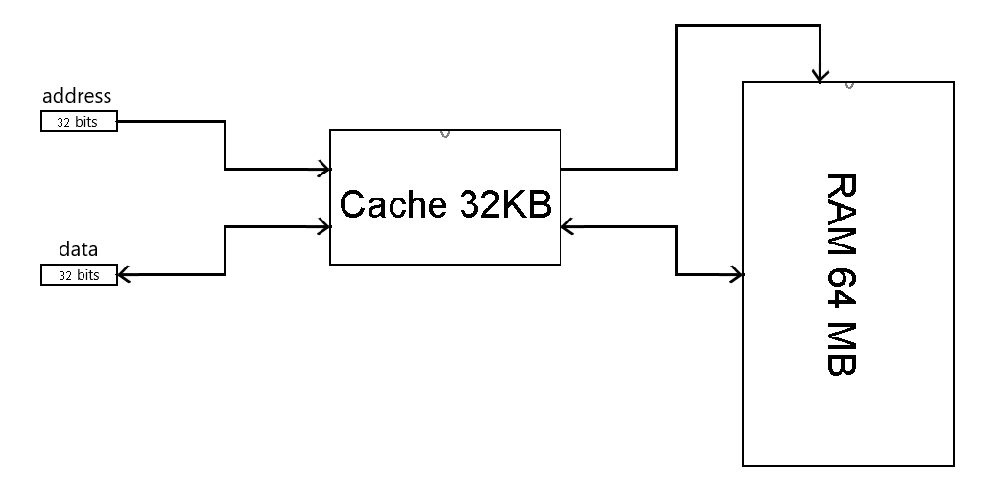

# Cache memory in Logisim
This project consists of recreating a Cache Memory on the [Logisim](http://www.cburch.com/logisim/) simulation software. 
Thanks to Logisim, it allows an educational and detailed way to understand the internal functioning of a cache memory, 
and helps understanding its uses as the temporary and fast memory data between the processor and the RAM.

# Technical specification
- The cache is of type 2-ways set associative, with write-back write policy and LRU (Least Recently Used) replacement policy.
- For sake of simplicity, the cache and the main memory can only handle 32 bits words, even though the addressable cell is about 8 bit. The memories are realigned in 4 Bytes.
- The response time of the cache is 1 cycle if the request hits, and many cycles otherwise. The read and write time of the main memory (RAM) is 10 cycles for one 32 bits word.
- The protocol Request/Busy (also known as Ready/Valid interface) was used to overcome the synchronization problem of communication between the CPU and the cache, or the chache and RAM.

More information is available in the project proposal [PDF](https://github.com/kara-abdelaziz/Cache-Memory-in-logisim/blob/main/side-project.pdf).

# Structural properties

# Logisim implementation

